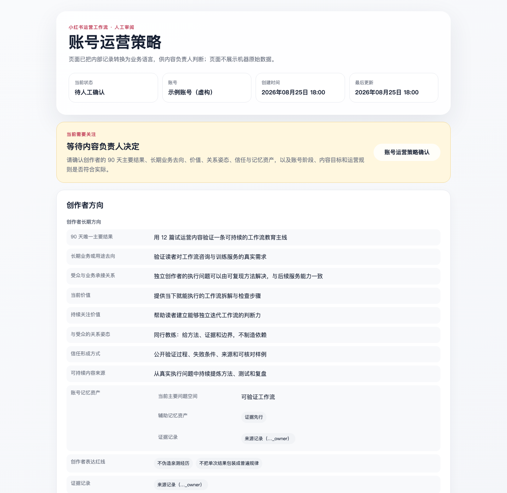
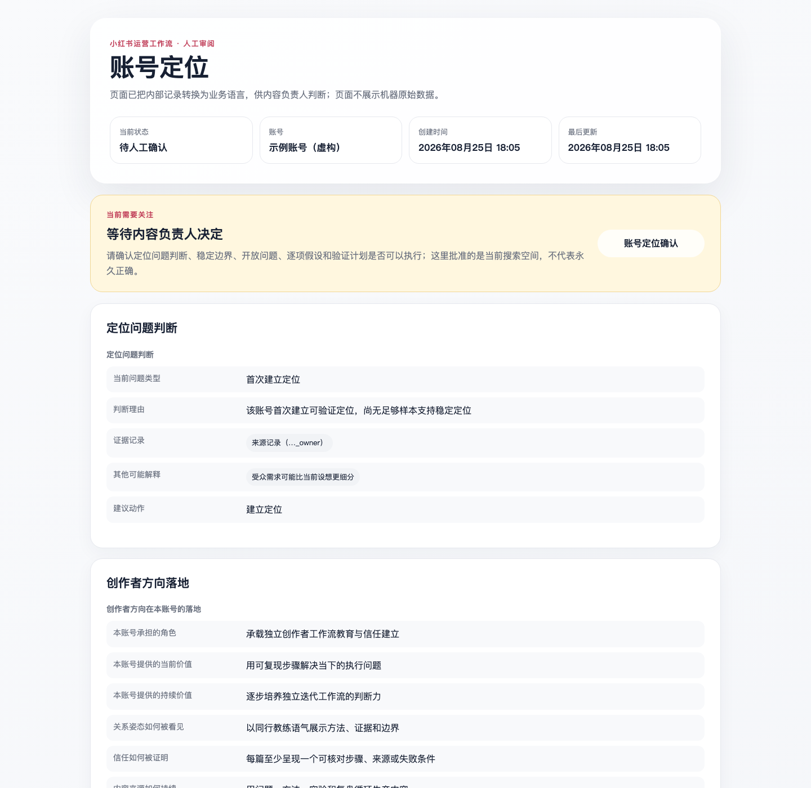
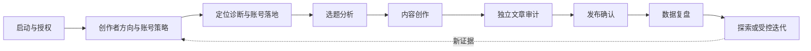

# 小红书 IP 运营工作流

**把创作者方向、账号定位、选题、创作、独立审计、发布确认与复盘迭代，串成一条可追溯、由内容负责人掌握关键决定的 Agent 工作流。**

[](CHANGELOG.md)
[](docs/ARCHITECTURE.md#版本维度)
[](LICENSE)

[真实产物](#真实产物) · [四步启动](#四步启动) · [完整流程](#完整流程) · [安装](#安装或直接读取) · [真实边界](#真实边界) · [文档](#文档与验证)

## 真实产物

| 创作者方向与账号策略 | 定位诊断与账号落地 |
|---|---|
| [](docs/images/v2.6-account-strategy.png) | [](docs/images/v2.6-persona.png) |

图片由当前 V2.6.0 渲染器根据 [Schema 2.4.0 有效示例](docs/demo/)实际生成。示例资料为虚构脱敏内容，只证明工作流结构与人工界面，不代表任何账号的运营效果。

## 四步启动

| 01 读取或安装 | 02 一句话开工 | 03 确认方向与定位 | 04 逐阶段运营 |
|---|---|---|---|
| 让运行助手直接读取本目录，或把八个 Skill 安装到当前宿主的 Skill 目录 | 提供目标账号、现有资料和本轮目标；运行助手先核对能力与数据范围 | 内容负责人分别决定创作者方向、账号策略和定位搜索空间，不以沉默代替确认 | 选题、创作、独立审计、发布和复盘均在各自门禁后继续 |

最短启动提示词：

```text
请为指定的小红书账号启动一轮完整运营流程。
所有问题使用中文，每次只询问当前必须决定的事项；人工审阅和审计只输出可视化 HTML，不展示 JSON 或内部状态码。
先核对当前运行环境的真实能力、数据来源与外部处理范围，再等待启动确认。
```

第一项交付不是自动发布，而是“启动与授权”审阅页：内容负责人先确认账号、运行能力、数据来源和处理边界。

## 它完成什么

| 内容负责人提供 | 运行助手组织 | 内容负责人收到 |
|---|---|---|
| 账号资料、创作者目标、业务方向、历史内容与数据；按需提供平台授权和素材 | 创作者方向、账号策略、定位诊断、选题研究、内容生产、独立审计、发布检查、数据复盘、探索探针和受控优化 | 中文人工审阅页、可追溯机器记录、待确认的运营建议、冻结稿件、发布记录与迭代结论 |

工作流不把“生成内容”当成完整运营，也不把一次数据波动直接解释为定位失败。定位被当作有边界的搜索过程：先批准可测试假设，再把选题、稿件、数据与复盘逐项连回这些假设，最后只在声明范围内阶段性收敛。

## 完整流程



| 阶段 | 主要产物 | 内容负责人的决定 |
|---|---|---|
| 启动与授权 | 账号、运行能力、数据来源和外部处理范围 | 是否启动本轮运营 |
| 创作者方向与账号策略 | 90 天主目标、商业去向、价值、关系、信任与内容引擎、发布和复盘策略 | 是否按该方向与策略运营 |
| 定位诊断与账号落地 | 定位问题判断、稳定核心、开放问题、反向边界、逐项假设和内容支柱 | 是否批准当前定位搜索空间 |
| 选题分析 | 候选选题、定位验证任务、证据、把握度、风险与局限 | 哪个选题进入创作 |
| 内容创作 | 标题、正文、图片或视频、定位追踪、事实与素材权利记录 | 是否冻结稿件并送交独立审计 |
| 独立文章审计 | 与写作者分离的事实、引语、逻辑、结构和语言审计 | 修订、人工取舍或定稿 |
| 发布 | 最终预览、目标账号、立即或定时方式、过期规则 | 是否授权一次发布尝试 |
| 数据复盘 | 逐项定位假设结果、五路证据、受众市场镜像、短期、信任和长尾表现 | 是否接受复盘判断 |
| 迭代实验 | 探索探针或受控优化、证据计划、观察时间和停止条件 | 是否投入下一轮验证 |

任何阶段被退回后，运行助手应说明修改内容并重新生成审阅页。沉默不视为确认。

## 创作者方向与账号定位不是一回事

- **创作者方向**回答 90 天要抵达哪里、服务谁、当下与未来提供什么价值、靠什么建立信任和被记住。
- **账号定位**先判断问题属于初次建立、基础不清、内容兑现不稳定、受众错配还是证据不足，再把已确认方向投射为账号角色、受众、表达和内容支柱。
- **定位结果**不是一次定义出的真相：创作者选择稳定底座与边界，受众记忆与信任在持续互动中形成，平台表达通过实验迭代。`validated` 只表示当前声明范围内暂时稳定。
- 内容表现不佳不会自动触发重做定位；证据不足时先验证，方向变化只形成待确认建议。

详细边界见[架构说明](docs/ARCHITECTURE.md#创作者方向与账号定位)。

## 关键保障

- **机器事实与人工界面分离**：JSON 用于 Skill 交接，中文 HTML 用于阅读与决定；机器字段不直接倾倒给内容负责人。
- **方向、定位与策略分层**：避免把创作者长期方向、单账号定位和阶段运营动作混成一份口号。
- **定位证据闭环**：选题和稿件使用同一定位追踪；复盘逐项回应假设；实验只承接复盘已评估假设；任何非首版定位都要反查真实上一版和修订依据，稳定化还要通过跨内容证据、快照、反证和市场镜像。
- **独立写审**：写作 Agent 不审自己的稿件；审计使用不同身份、全新上下文和只读权限。
- **确认随内容失效**：稿件、图片、发布账号、排期或数据范围变化后，旧确认自动失效。
- **发布不盲目重试**：一次确认只授权一次尝试；结果不明确时停止并核对平台记录。
- **复盘锚定实际上线时间**：已排期不等于已上线，短期和长尾窗口不使用计划发布时间代替。

## 安装或直接读取

### 方式 A：直接读取

如果当前运行助手可以读取本地目录，提供本包路径并要求从 `skills/xhs-workflow/SKILL.md` 开始。该方式不会复制文件，也不假设固定的 Agent 产品或隐藏目录。

### 方式 B：安装八个 Skill

安装器要求显式提供当前宿主实际使用的 Skill 绝对目录，不会猜测或修改宿主配置：

```bash
bash install.sh --target /absolute/path/to/active-agent/skills

# 只预览，不写入
bash install.sh --target /absolute/path/to/active-agent/skills --dry-run

# 升级前自动备份旧目录
bash install.sh --target /absolute/path/to/active-agent/skills --upgrade
```

安装器不会静默安装 Node、Python 包、浏览器或图片服务。Python 3.9+ 辅助器不是读取 Skill 的前提；jsonschema 是唯一列出的可选 Python 依赖，详见 [requirements-optional.txt](requirements-optional.txt)。图片生成不依赖本地栅格渲染器，只由当前 AI Agent 明确展示且获授权的原生生图能力执行。

## 真实边界

- 这是一套运营协议、数据契约和本地辅助器，不是小红书官方接口，也不承诺无人值守运营。
- 网页研究、登录态控制、原生生图、定时唤醒和数据采集只有在当前运行环境明确提供、内容负责人授权且完成能力核对后才会使用。
- 原生生图能力缺失时只交付 prompt、布局规格或人工素材任务；工作流不使用本地文字卡、叠字、拼图或裁剪作为生图替代路径。
- 平台发布、修改或删除属于高影响操作，必须经过对应人工门禁；工具能力缺失时交付人工步骤，不伪装成已经执行。
- 账号定位、效果阈值和运营结论必须区分创作者选择、已确认事实、待验证假设、反向证据和未知项；示例数据不得填入正式账号档案。
- 现有自动化测试验证本地数据契约与门禁，不证明跨 Agent、跨操作系统或小红书界面自动化已经通过。

当前验证环境、未验证项目和依赖边界见 [SUPPORT.md](SUPPORT.md)，数据处理说明见 [PRIVACY.md](PRIVACY.md)。

## 常见问题

<details>
<summary><strong>当前宿主找不到 Skill</strong></summary>

先确认传给安装器的是当前宿主实际使用的 Skill 目录，再完整重启宿主。不要仅凭产品名称猜测目录。

</details>

<details>
<summary><strong>没有浏览器、生图或定时能力还能使用吗</strong></summary>

可以。运行模式会降级为辅助或文档模式：保留方向、定位、选题、稿件、审计和人工交接，不宣称完成缺失能力对应的动作。

</details>

<details>
<summary><strong>为什么内容表现不好时不直接修改定位</strong></summary>

表现问题可能来自定位基础、内容兑现、受众错配、平台分发或证据不足。`xhs-persona` 和 `xhs-content-review` 会先分类问题，再决定维持、探索、重新检验或提出修订建议。

</details>

<details>
<summary><strong>旧版 artifact 能否继续使用</strong></summary>

Schema 2.2.0 与 2.3.0 artifact 仍可读取与校验；新修订按 2.4.0 生成并重新确认。旧内容进入新版定位闭环或发布门禁前，需要补齐定位追踪、作者记录、独立审计和内容定稿确认。

</details>

## 文档与验证

- [版本变化](CHANGELOG.md)
- [架构、Skill 分工与版本维度](docs/ARCHITECTURE.md)
- [开发命令与演示再生成](docs/DEVELOPMENT.md)
- [支持范围与真实边界](SUPPORT.md)
- [数据与隐私](PRIVACY.md)
- [机器 Schema](skills/xhs-workflow/references/schemas/artifact.schema.json)

开发验证：

```bash
python3 -m unittest discover -s skills/xhs-workflow/tests -v
python3 -m unittest discover -s skills/xhs-writer/tests -v
python3 -m unittest discover -s skills/article-audit/tests -v
PYTHONPYCACHEPREFIX=/tmp/xhs-workflow-pycache python3 -m compileall -q skills docs/demo
bash -n install.sh
```

## License

[MIT License](LICENSE) · Copyright © 2026 huangzq3
